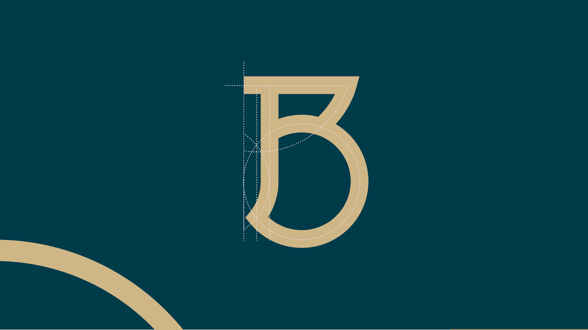

# projeto-mobile-Biancaa-Pereira

# Sobre o que é o projeto?

Este projeto apresanta o layout de um banco. Nenhum banco existente foi copiado ou usado as imagens, apenas para organização.

# Tecnologias utilozadas

HTML e CSS.

# Prints da Tela em modo responsivo

# Abas do Menu abertas

# Imagem usada como logo

